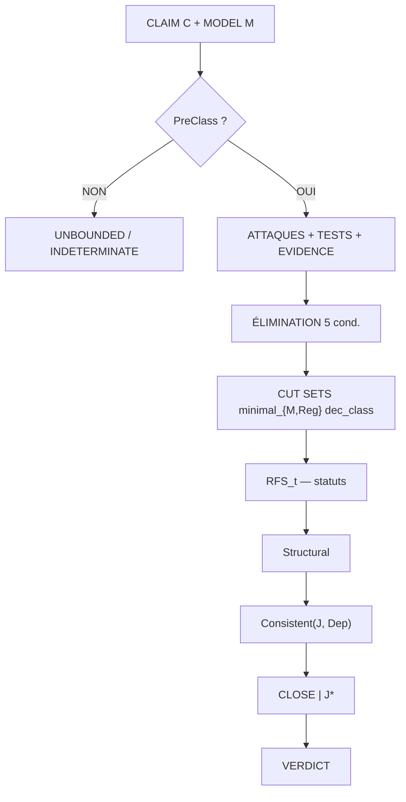
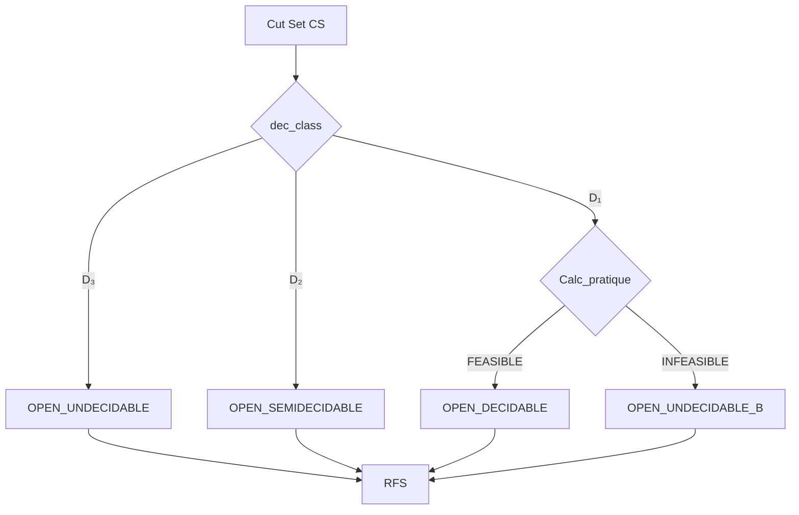
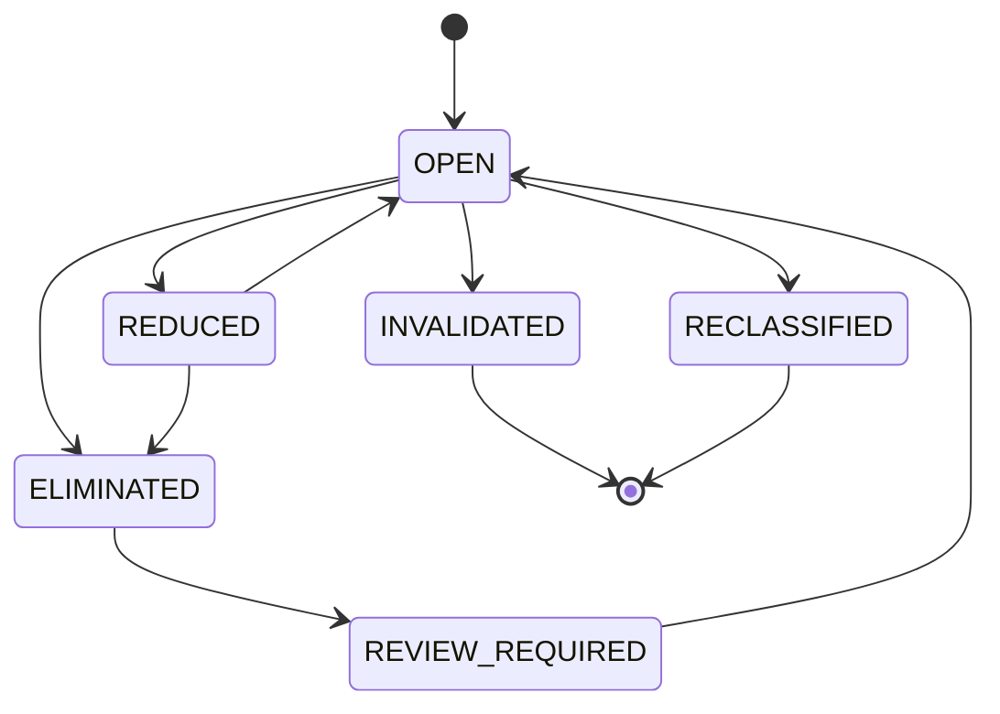

# TITAN v6.0 — Document de référence consolidé et outillé

**Auteur : Hachem Youssef**  
**Date : 27/09/2026**  
**Statut : dernière version documentaire — suivie d'exécution empirique**

---

## Avertissement — Le statut particulier de v6.0

Ce document est le dernier document de référence de TITAN.

Tout ce qui suit est nécessaire mais non suffisant. La phase suivante n'est plus documentaire. Elle est empirique : appliquer le noyau formel à des cas publics, mesurer FCI-C, recueillir des catches confirmés par un reviewer externe.

Toute version postérieure de TITAN (v6.1, v7.0) doit être motivée par un résultat empirique, pas par une nouvelle consolidation rédactionnelle.

Ce document intègre :

- la doctrine héritée de v1.2 (stable) ;
- le noyau formel v4.0 (5 corrections intégrées) ;
- la spécification d'implémentation ;
- l'algèbre de versions ;
- l'analyse de robustesse ;
- l'indicateur FCI-C ;
- le critère de mort et l'engagement de falsifiabilité ;
- le protocole expérimental ;
- l'outillage opérationnel (grille de qualification, candidats, format de rapport) — ajout de v6.0.

---

# PARTIE 0 — STATUT, PORTÉE, ENGAGEMENT

## 0.1 Nature

TITAN est un cadre d'assurance adversariale bornée.

Il n'est ni un moteur de vérité, ni un calculateur de probabilité, ni un score de sécurité, ni un substitut à une décision.

Il organise l'examen d'une affirmation critique par :

- explicitation d'un modèle borné ;
- génération adversariale d'hypothèses de falsification ;
- séparation stricte entre attaque, test, observation, évidence ;
- représentation des chemins résiduels de falsification (RFS) ;
- enregistrement explicite des lacunes du modèle (MSG) ;
- traitement séparé des inconnues et contradictions ;
- arrêt à une profondeur méta déclarée ;
- versionnement et invalidation des évidences ;
- séparation stricte entre verdict épistémique et décision de gouvernance.

## 0.2 Position de nouveauté

Aucune nouveauté scientifique n'est revendiquée sur les primitives. Voisinage : Eliminative Argumentation, Assurance 2.0, FTA / minimal cut sets, GSN/CAE/SACM, Toulmin, Graydon & Holloway.

La nouveauté éventuelle porte sur une intégration doctrinale et opératoire, à valider par expérimentation différentielle.

## 0.3 Engagement de falsifiabilité

Si sur 10 cas réellement traités avec reviewer externe, TITAN produit 0 catch confirmé au sens de §VII.1, la thèse centrale est fausse et le cadre doit être abandonné en tant que contribution scientifique.

Cet engagement est intégré au document. Il est public.

---

# PARTIE I — DOCTRINE

## I.1 Principe directeur

Soit une affirmation critique C.

Question refusée : « Quelle est la probabilité que C soit vraie ? »

Question TITAN : « Quelles falsifications de C restent ouvertes dans le domaine explicitement modélisé, lesquelles ont été éliminées, et quelles parties pertinentes restent insuffisamment couvertes ? »

Invariant de conception :

```text
Conclusion ≤ Coverage
```

## I.2 Ontologie

```text
World ≠ Model ≠ Tested Domain ≠ Observation ≠ Evidence ≠ Conclusion
```

## I.3 Les 4 états globaux

| État | Condition |
|---|---|
| `FALSIFIED` | Un contre-exemple valide a été observé |
| `OPEN` | `RFS ≠ ∅`, chemins connus, toutes autres conditions vides |
| `INDETERMINATE` | `MSG_critical ≠ ∅` ∨ `UNKNOWN_blocking ≠ ∅` ∨ `CONTRADICTIONS_open ≠ ∅` ∨ décomposition non signée ∨ désaccord non résolu ∨ `RFS` vacuous ∨ graphe ≠ `COMPLET` ∨ `PreClass` échoué ∨ `Consistent` échoué ∨ budget `INFEASIBLE` |
| `BOUNDED_NON_FALSIFIED` | `RFS = ∅` ∧ 7 conditions CLOSE ∧ 8 clauses Structural |

Le quatrième état n'existe pas. Aucun état `TRUE`, `DÉMONTRÉ`, `CONFORME`.

## I.4 Séparation verdict / décision

Le verdict est produit par TITAN. La décision est extra-épistémique, tracée séparément.

Actions :

```text
ACCEPT_RESIDUAL | MITIGATE | REFUSE
```

---

# PARTIE II — NOYAU FORMEL

## II.1 Sortes

```text
A, T, O, CS, C, M, St, Dom, Dec, Reg, J, Dep, Budget
Dom   = Dom_Fin ∪ Dom_Symb ∪ Dom_Struct
Dec   = {D₁, D₂, D₃}
```

## II.2 Prédicats

```text
PreClass           : Reg → Prop
dom                : A × M → Dom
dec_class_a        : A → Dec
dec_class_cs       : CS → Dec ∪ {UNDEFINED}
dec_class_cs(CS)   = max_{a ∈ CS} dec_class_a(a) si PreClass
                   = UNDEFINED                    sinon
                   priorité : D₃ > D₂ > D₁

Calc_théorique     : CS → Dec
Calc_pratique      : CS × Budget → {FEASIBLE, INFEASIBLE, UNKNOWN}
statut_ouverture   : CS × Budget → St

minimal_{M, Reg}   : CS × C → Prop
causally_dependent : A × A → Prop
elim               : A × M × Reg → Prop
RFS_t              : C × M × Reg × Budget → 2^CS
Consistent         : J* × Dep → Prop
CLOSE              : C × M × Reg × Budget → Prop
```

## II.3 Règles

### Elim-A-2

```text
PreClass(Reg)
dom(A, M) déclarée
cov(T, A) ≠ ∅
cover(T, A) ≠ ?
∀ d' ∈ cov(T, A) : ¬succ(A, d')
gen_valid(T, A, dom(A, M))
────────────────────────────────
elim(A, M, Reg)
```

### CS-Min-3

```text
CS ⊆ attacks(Reg)
(∧_{a ∈ CS} succ(a, dom(a, M))) ⊨ ¬C
¬∃ CS' ⊂ CS : (∧_{a ∈ CS'} succ(a, dom(a, M))) ⊨ ¬C
¬∃ a, a' ∈ CS : causally_dependent(a, a')
────────────────────────────────
minimal_{M, Reg}(CS, C)
```

### Open-CS-4

```text
PreClass(Reg)
dec_class_cs(CS) ≠ UNDEFINED
∀ a ∈ CS : ¬elim(a, M, Reg)
────────────────────────────────
statut_ouverture(CS, Budget) ∈ {
    OPEN_DECIDABLE,
    OPEN_SEMIDECIDABLE,
    OPEN_UNDECIDABLE,
    OPEN_UNDECIDABLE_B
}
```

### RFS-Rule-3

```text
RFS_t(C, M, Reg, Budget) =
    {CS | minimal_{M, Reg}(CS, C) ∧ statut_ouverture(CS, Budget) défini}
```

### CLOSE-Rule-4

```text
Structural(C, M, Reg)
Consistent(J₁, …, J₅, Dep)
J₁ : CriticalMSG = ∅
J₂ : BlockingUnknown = ∅
J₃ : OpenContradictions = ∅
J₄ : BoundariesAccepted
J₅ : GeneralizationsJustified | J₄ = TRUE
──────────────────────────────────────────────
CLOSE(C, M, Reg, Budget) | {J₁..J₅, Consistency_Check}
```

## II.4 Structural — 8 clauses

1. `PreClass(Reg)`
2. `¬∃ valid_counterexample(C, M)`
3. `RFS_t(C, M, Reg, Budget) = ∅`
4. `minimality_satisfied_{M, Reg}`
5. `evidence_current`
6. `version_consistent`
7. `decomposition_completed`
8. `dependency_graph_status = COMPLET`

## II.5 Métathéorèmes

| # | Énoncé |
|---|---|
| T1 | `RFS = ∅` ssi `PreClass ∧ tous D₁ ∧ FEASIBLE ∧ graphe COMPLET` |
| T2 | `elim(A, M.v1, Reg) ⇏ elim(A, M.v2, Reg)` si `Δ ≠ ∅` |
| T3 | `minimal_{M,Reg}(CS) ⇏ minimal_{M',Reg'}(CS)` |
| T4 | `CLOSE` non décidable en général |
| T5 | `dec_class(CS) = max_{a ∈ CS} dec_class_a(a)` si `PreClass` |
| T6 | `CLOSE` exige `Consistent(J₁..J₅, Dep)` |

---

# PARTIE III — IMPLÉMENTATION

## III.1 Schéma SQL — extrait

Tables :

```text
claim
model
budget
attack
test
observation
evidence
cut_set
msg
unknown
contradiction
disagreement
critical_judgment
judgment_dependency
consistency_check
audit_log
```

Champs critiques :

- `attack.dec_class ∈ {D1, D2, D3}` — obligatoire ;
- `model.dependency_graph_status ∈ {COMPLET, PARTIEL, INCONNU}` ;
- `budget : temps_max, memoire_max, solveur_max, iterations_max` ;
- `msg.recorded_as_critical` : jugement documenté avec auteur et date ;
- `audit_log WITH (appendonly = true)`.

## III.2 Algorithmes

| Fonction | Complexité |
|---|---|
| `PreClass` | `O(|A|)` |
| `dec_class_cs` | `O(|CS|)` |
| `elim` | `O(1)` à `O(n états)` |
| `RFS` (mode C) | `O(2^|A|)` — `|A| ≤ 25` |
| `hitting_set` | NP-difficile — `|CS| ≤ 50` |
| `Consistent` | `O(|Dep| + |J|)` |

## III.3 API

```text
POST   /claim, /attack, /test, /observation, /evidence
POST   /budget, /judgment, /disagreement, /contradiction
GET    /claim/{id}/state, /rfs, /hinges, /hitting-set
GET    /claim/{id}/judgments, /dependency-graph, /consistency
POST   /claim/{id}/precheck, /consistency
POST   /audit/query
```

Aucune API ne retourne de score.

---

# PARTIE IV — VERSIONNEMENT

Opérations :

```text
Create, Modify, Branch, Merge, Revert
```

Différentiel :

```text
Δ(M_old, M_new) =
    (Δ_scope, Δ_assumptions, Δ_boundaries,
     Δ_dependencies, Δ_tools)
```

`Preserve(A, M_old, M_new)` : soit `Δ = ∅` avec identité vérifiée, soit `Δ ≠ ∅` avec `preservation_proof` signé. Contestable.

Rollback conserve l'historique.

---

# PARTIE V — ROBUSTESSE

## V.1 Modes de défaillance

| Mode | Mitigation |
|---|---|
| Capture falsificateur informé | Falsificateur aveugle + filtre pertinence |
| Saturation MSG | K2 — ratio seuil |
| Explosion cut sets | Bornage `UNBOUNDED` |
| Désaccords non résolus | Procédure obligatoire |
| Évidences périmées | Régénération |
| Absence d'élimination | K1 |
| Budget `INFEASIBLE` | Revoir budget |

## V.2 Ce que TITAN ne mesure pas

- Qualité des jugements critiques ;
- Complétude de la décomposition ;
- Compétence des falsificateurs ;
- Représentativité du modèle.

---

# PARTIE VI — FCI-C

## VI.1 Définition

```text
FCI-C(M₁, M₂) = |A(M₁) \ A(M₂)| / |A(M₂)|
```

où `A(M)` est l'ensemble des attaques jugées pertinentes par un reviewer externe.

## VI.2 Interprétation

| FCI-C | Signification |
|---|---|
| `0` | Aucune attaque nouvelle |
| `0–0.2` | Apport marginal |
| `0.2–0.5` | Apport significatif |
| `≥ 0.5` | Apport fort — vérifier pertinence |

## VI.3 Limite

FCI-C est un indicateur, pas une preuve. Il conditionne l'utilité des directions futures.

---

# PARTIE VII — CRITÈRE DE MORT

## VII.1 Définition du catch

Un catch doit satisfaire les cinq conditions suivantes :

1. TITAN produit un signal `OPEN / INDETERMINATE / MSG critique / Consistency FAILED` ;
2. le signal est absent de la méthode de référence ;
3. il est confirmé par un reviewer externe ;
4. il est non trivial ;
5. il est actionnable.

## VII.2 Seuil

`0 catch sur 10 cas avec reviewer externe ⇒ abandon.`

## VII.3 Probabilités annoncées

Ces valeurs sont des hypothèses déclarées avant expérimentation, et non des résultats :

| Scénario | Probabilité annoncée |
|---|---:|
| F3 — stérile | 55–60 % |
| Limité (1–2) | 30–35 % |
| Fort (3+) | 10–15 % |

---

# PARTIE VIII — PROTOCOLE EXPÉRIMENTAL

## VIII.1 Corpus

**Famille A — 5 cas bien bornés**

- protocoles crypto ;
- algorithmes ;
- formats ;
- protocoles industriels.

**Famille B — 5 cas mal bornés**

- chaînes logistiques ;
- MFA ;
- cloud ;
- vote.

## VIII.2 Comparaison

Par cas :

```text
TITAN complet / TITAN dégradé / EA / revue non structurée
```

## VIII.3 Mesures

- Verdicts ;
- `INDETERMINATE` ;
- FCI-C ;
- catches.

## VIII.4 Durée

- Phase 1 (A+B) : 3–4 semaines ;
- Phase 2 (famille C) : 12 mois.

---

# PARTIE IX — OUTILLAGE OPÉRATIONNEL

## IX.1 Grille de qualification de pertinence

Objet : guider le reviewer externe dans la qualification de chaque attaque supplémentaire produite par TITAN.

Pour chaque attaque `a ∈ A(TITAN) \ A(EA)` :

| Critère | Question | Réponse |
|---|---|---|
| C1 — Falsifiabilité | L'attaque est-elle falsifiable ? | O/N |
| C2 — Domaine | Le domaine est-il défini ? | O/N |
| C3 — Lien au claim | L'attaque peut-elle invalider C ? | O/N |
| C4 — Non-redondance | L'attaque est-elle absente d'EA ? | O/N |
| C5 — Actionnabilité | Une mitigation est-elle concevable ? | O/N |

Règle : une attaque est qualifiée pertinente si O sur les 5 critères.

Cas limite : si C4 est faux (attaque déjà dans EA), l'attaque est redondante, non pertinente au sens de FCI-C.

Cas à discuter : si C3 est ambigu (lien au claim contestable), l'attaque est marquée « à discuter » et n'entre ni dans FCI-C ni dans les catches. Elle est tracée dans le rapport.

## IX.2 Candidats pour les 5 cas publics (famille A)

Critères :

- Domaine fini ou quasi-fini (D₁ majoritaire) ;
- Documentation publique accessible ;
- Méthode de référence applicable (EA ou GSN) ;
- Pas de propriétaire bloquant la publication.

| # | Cas | Domaine | Méthode | Pourquoi |
|---|---|---|---|---|
| 1 | TLS 1.3 hybride (X25519MLKEM768) | Crypto | EA | Domaine borné, spec publique, enjeux actuels |
| 2 | Signal Protocol (double ratchet) | Crypto | EA | Documentation publique, analyse formelle existante |
| 3 | Tri par insertion sur C99 | Algorithme | EA | Domaine fini, contrôle |
| 4 | Protocole Modbus TCP | Industriel | EA + GSN | Documenté, connu, sécurité critique |
| 5 | Format de sérialisation CBOR | Format | EA | Spec RFC 8949, parsing, tolérance aux erreurs |

Sélection finale : par un tiers. Un reviewer externe doit pouvoir choisir lui-même 5 cas parmi une liste élargie.

## IX.3 Format du rapport final

```text
RAPPORT TITAN — PHASE 1 — [DATE]

1. Résumé exécutif
   - Nombre de cas traités
   - Nombre de catches
   - FCI-C moyen
   - Verdict global (F3 / limité / fort)

2. Pour chaque cas :
   2.1 Claim et modèle
   2.2 Méthode de référence appliquée
   2.3 Résultats TITAN : RFS, MSG, statuts
   2.4 Résultats EA
   2.5 Différentiel : attaques supplémentaires TITAN
   2.6 Qualification par reviewer externe (grille §IX.1)
   2.7 FCI-C calculé
   2.8 Catches identifiés (si applicable)

3. Analyse transverse
   - Distribution des statuts (OPEN_DECIDABLE / SEMI / UNDEC)
   - Taux d'INDETERMINATE
   - Taux de MSG critiques
   - Taux de Consistent FAILED

4. Discussion
   - Où TITAN apporte de l'information nouvelle
   - Où TITAN ne produit que du bruit
   - Zones où le noyau formel craque

5. Conclusion
   - Décision : continuer / étendre / abandonner
   - Justification
   - Prochaine étape
```

Règle : le rapport est publié quel que soit le résultat. Un résultat F3 est une information, pas un échec à cacher.

---

# PARTIE X — DIRECTIONS FUTURES

| Direction | Tractabilité | Impact | Risque F3 |
|---|---|---|---|
| FCI-C + Phase 1 | Élevée | Élevé (décisif) | — |
| Multi-agent (hétérogène) | Moyenne | Moyen-élevé | Moyen |
| MSG-S2 | Moyenne | Élevé | Élevé |
| Théorie de l'incomplétude | Faible | Très élevé | Faible |

Ordre :

```text
FCI-C → Multi-agent → MSG-S2 → Théorie
```

Contrainte : aucun multi-agent avant que FCI-C ne soit mesuré sur la phase 1.

### Sur le multi-agent — avertissement

La séparation des rôles n'empêche pas la convergence des biais. Si les agents partagent le même modèle sous-jacent, ils ont les mêmes angles morts.

Hétérogénéité obligatoire :

- modèles différents ;
- prompts par rôle ;
- agent adversaire dédié ;
- humain dans la boucle pour validation.

---

# PARTIE XI — DIAGRAMMES

## XI.1 Architecture globale

```text
CLAIM C + MODEL M
      │
      ▼
PreClass(Reg) ?
      │
  ┌───┴───┐
  ▼       ▼
 OUI     NON → UNBOUNDED / INDETERMINATE
  │
  ▼
ATTACKS + TESTS + OBS + EVIDENCE
  │
  ▼
ELIMINATION (5 conditions)
  │
  ▼
CUT SETS (minimal_{M, Reg}, dec_class ∈ {D₁,D₂,D₃})
  │
  ▼
RFS_t(C, M, Reg, Budget) — statuts d'ouverture
  │
  ▼
Structural ∧ Consistent(J₁..J₅, Dep) ∧ Judgment
  │
  ▼
CLOSE | {J*} — théorème conditionnel
  │
  ▼
VERDICT + CRITICAL_JUDGMENTS + BUDGET + DEPENDENCIES
```

## XI.2 Les 4 états

```text
FALSIFIED (terminal)
    │
    ├──► OPEN ──► BOUNDED_NON_FALSIFIED
    │              (7 conditions + 8 clauses)
    │
    └──► INDETERMINATE
```

## XI.3 Mermaid — Architecture



## XI.4 Mermaid — Décidabilité



## XI.5 Mermaid — Cycle de vie attaque



---

# PARTIE XII — CAS TRAVAILLÉS

| Cas | Verdict | Cause |
|---|---|---|
| C-ABS-32 | FALSIFIED | `abs(INT_MIN) < 0` |
| C-LOCK-VNE4 | OPEN | 3 CS ouverts `OPEN_DECIDABLE` |
| C-LOCK-PROD | INDETERMINATE | `MSG-REMOTE-MAINT` critique |
| C-SORT-2 | BOUNDED_NON_FALSIFIED | Domaine fini, 7 conditions + 8 clauses |
| C-INDET-DISAGREE | INDETERMINATE | Désaccord non résolu |

Régimes non couverts à traiter :

- `Consistent FAILED` (`J₄=FALSE`, `J₅=TRUE`, `(J₄,J₅) ∈ Dep`) ;
- `OPEN_UNDECIDABLE_B` (CS en D₁, budget `INFEASIBLE`).

---

# PARTIE XIII — CLÔTURE

## XIII.1 Ce que v6.0 est

- Document de référence final de TITAN.
- Noyau formel couvrant le chemin décisionnel.
- Outillage opérationnel complet (grille, candidats, format de rapport).
- Critère de mort explicite.
- Engagement de falsifiabilité public.

## XIII.2 Ce que v6.0 n'est pas

- Un moteur logiciel.
- Un résultat empirique.
- Une contribution scientifique validée.

## XIII.3 Ce qui reste ouvert

| # | Point | Nature |
|---|---|---|
| 1 | Certification `COMPLET` | Reviewer |
| 2 | Graphe `Dep` | Reviewer |
| 3 | `Preserve` contestable Q2 | — |
| 4 | Traduction `¬C → logique` | Recherche |
| 5 | `UNDECLARED` sans algorithme | Absence assumée |
| 6 | Budget par gouvernance | Gouvernance |
| 7 | Reviewer externe | Organisation |
| 8 | Phase 2 (12 mois) | Temps |

## XIII.4 Prochaine action

Exécuter la phase 1 du protocole §VIII sur les 5 cas candidats §IX.2, avec la grille §IX.1, produire le rapport §IX.3.

Cette exécution est la seule action utile. Elle produira :

- 0 catch sur 5 cas → arrêt ou pivot famille B ;
- 1–2 catches → signal faible, étendre ;
- 3+ catches → signal fort, publier.

Sans reviewer externe, l'expérience est auto-évaluée et perd sa valeur.

## XIII.5 La règle finale

Aucune nouvelle version documentaire de TITAN ne sera produite tant que la phase 1 du protocole n'aura pas été exécutée et que ses résultats n'auront pas été publiés.

Cette règle clôt la phase théorique.

---

# FIN — TITAN v6.0

**Auteur : Hachem Youssef**  
**Date : 27/09/2026**  
**Statut : dernière version documentaire**

### 13 parties

```text
0   Statut, engagement
I   Doctrine
II  Noyau formel
III Implémentation
IV  Versionnement
V   Robustesse
VI  FCI-C
VII Critère de mort
VIII Protocole expérimental
IX  Outillage opérationnel
X   Directions futures
XI  Diagrammes
XII Cas travaillés
XIII Clôture et engagement
```

### Nouveau dans v6.0

- Grille de qualification (IX.1)
- 5 cas candidats (IX.2)
- Format de rapport (IX.3)
- Règle finale : plus aucune version documentaire avant exécution empirique

### Engagement

```text
0 catch sur 10 cas avec reviewer externe
⇒ abandon de la thèse centrale
```

### Probabilités annoncées

```text
F3 stérile           : 55–60 %
Contribution limitée : 30–35 %
Contribution forte   : 10–15 %
```

```text
Aucun score.
Aucune conformité déclarée.
Aucune vérité revendiquée.
Aucune nouvelle version avant exécution.
```
